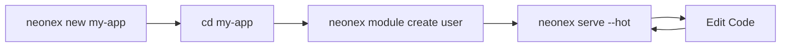

# CLI Tools Overview

Neonex Core provides a powerful command-line interface (CLI) for scaffolding, development, and project management.

---

## Installation

The `neonex` CLI is automatically available after installing the framework:

```bash
# Install globally
go install github.com/neonextechnologies/neonexcore/cmd/neonex@latest

# Verify installation
neonex --version
```

**Output:**
```
Neonex Core CLI v1.0.0
A modern, modular Go framework
```

---

## Available Commands

### Core Commands

| Command | Description | Documentation |
|---------|-------------|---------------|
| `neonex new` | Create a new project | [→ Details](neonex-new.md) |
| `neonex serve` | Start development server | [→ Details](neonex-serve.md) |
| `neonex module` | Manage modules | [→ Details](neonex-module.md) |

### Global Flags

All commands support these flags:

```bash
-h, --help       # Show help for command
-v, --version    # Show CLI version
```

---

## Quick Reference

### Create New Project

```bash
# Basic usage
neonex new my-app

# Navigate and run
cd my-app
neonex serve --hot
```

### Start Development Server

```bash
# With hot reload (recommended)
neonex serve --hot

# Normal mode
neonex serve

# Custom port
neonex serve --port 3000
```

### Generate Module

```bash
# Create new module
neonex module create product

# List all modules
neonex module list
```

---

## Command Workflow

### Typical Development Cycle



**Step by step:**

1. **Create Project**
   ```bash
   neonex new my-app
   cd my-app
   ```

2. **Generate Modules**
   ```bash
   neonex module create user
   neonex module create product
   ```

3. **Start Development**
   ```bash
   neonex serve --hot
   ```

4. **Code & Test**
   - Edit files → auto-reload → test changes
   - Hot reload watches for changes

5. **List Modules**
   ```bash
   neonex module list
   ```

---

## Features

### 🚀 Fast Scaffolding

Generate complete project structures in seconds:

```bash
neonex new my-app
```

**Creates:**
- ✅ Complete directory structure
- ✅ Go module files (`go.mod`, `go.sum`)
- ✅ Configuration files (`.env`, `.air.toml`)
- ✅ Build automation (`Makefile`)
- ✅ Example module
- ✅ Git repository

### 🔥 Hot Reload

Automatic code reloading during development:

```bash
neonex serve --hot
```

**Benefits:**
- 🔄 Auto-rebuild on file changes
- ⚡ Fast feedback loop
- 🎯 Watches `.go`, `.html`, `.json` files
- 🛡️ Graceful restart

### 📦 Module Generation

Create fully-featured CRUD modules:

```bash
neonex module create product
```

**Generates 9 files:**
1. `model.go` - GORM model with tags
2. `repository.go` - Data access layer
3. `service.go` - Business logic
4. `controller.go` - HTTP handlers
5. `routes.go` - API endpoints
6. `di.go` - Dependency injection
7. `seeder.go` - Test data
8. `{module}.go` - Module entry point
9. `module.json` - Metadata

### 📋 Module Discovery

Automatically find and list all modules:

```bash
neonex module list
```

**Shows:**
- Module name
- Version
- Dependencies
- Status (active/inactive)

---

## Installation Methods

### Method 1: Go Install (Recommended)

```bash
go install github.com/neonextechnologies/neonexcore/cmd/neonex@latest
```

**Pros:**
- ✅ Always latest version
- ✅ Automatic updates
- ✅ Global availability

**Requirements:**
- Go 1.21+
- `$GOPATH/bin` in `$PATH`

### Method 2: Build from Source

```bash
# Clone repository
git clone https://github.com/neonextechnologies/neonexcore.git
cd neonexcore

# Build CLI
go build -o neonex cmd/neonex/main.go

# Move to PATH
sudo mv neonex /usr/local/bin/  # Linux/Mac
# or copy to %GOPATH%\bin         # Windows
```

### Method 3: Download Binary

Download pre-built binaries from [GitHub Releases](https://github.com/neonextechnologies/neonexcore/releases):

```bash
# Linux/Mac
curl -L https://github.com/neonextechnologies/neonexcore/releases/latest/download/neonex-linux-amd64 -o neonex
chmod +x neonex
sudo mv neonex /usr/local/bin/

# Windows (PowerShell)
Invoke-WebRequest -Uri "https://github.com/neonextechnologies/neonexcore/releases/latest/download/neonex-windows-amd64.exe" -OutFile "neonex.exe"
```

---

## Configuration

### Environment Variables

CLI respects these variables:

```bash
# Project name template
NEONEX_PROJECT_NAME=my-app

# Default port for serve
NEONEX_PORT=8080

# Enable debug output
NEONEX_DEBUG=true
```

### Config File

Create `~/.neonexrc` for global settings:

```json
{
  "defaultPort": 8080,
  "hotReload": true,
  "autoMigrate": true,
  "verbose": false
}
```

---

## Examples

### Example 1: New E-commerce Project

```bash
# Create project
neonex new ecommerce-api
cd ecommerce-api

# Generate modules
neonex module create product
neonex module create category
neonex module create order
neonex module create customer

# Start development
neonex serve --hot
```

### Example 2: Add Module to Existing Project

```bash
# Navigate to project
cd my-existing-app

# Generate new module
neonex module create payment

# Module automatically registered
# Routes: /payment/
```

### Example 3: Production Build

```bash
# Create project
neonex new production-app
cd production-app

# Build binary
go build -o bin/app main.go

# Run in production
./bin/app
```

---

## Troubleshooting

### Command Not Found

**Problem:**
```bash
neonex: command not found
```

**Solution:**
```bash
# Check Go bin directory
echo $GOPATH/bin  # Linux/Mac
echo %GOPATH%\bin # Windows

# Add to PATH
export PATH=$PATH:$GOPATH/bin  # Linux/Mac
```

### Air Not Found

**Problem:**
```bash
Error: Air not found. Install? (y/n)
```

**Solution:**
```bash
# Auto-install (recommended)
y

# Or manual install
go install github.com/air-verse/air@latest
```

### Permission Denied

**Problem:**
```bash
mkdir: permission denied
```

**Solution:**
```bash
# Check directory permissions
ls -la

# Run with sudo (if needed)
sudo neonex new my-app

# Or choose different directory
cd ~/projects
neonex new my-app
```

### Port Already in Use

**Problem:**
```bash
Error: Port 8080 already in use
```

**Solution:**
```bash
# Use different port
neonex serve --port 3000

# Or kill existing process
lsof -ti:8080 | xargs kill  # Linux/Mac
netstat -ano | findstr :8080 # Windows
```

---

## Tips & Tricks

### 1. Alias Commands

Create shortcuts in your shell:

```bash
# Add to ~/.bashrc or ~/.zshrc
alias nx='neonex'
alias nxn='neonex new'
alias nxs='neonex serve --hot'
alias nxm='neonex module'

# Usage
nxn my-app
nxs
nxm create user
```

### 2. Project Templates

Save project structure for reuse:

```bash
# Create template
neonex new template-project
cd template-project
# Configure as needed

# Copy for new projects
cp -r template-project new-project
cd new-project
```

### 3. Module Naming Conventions

Follow Go naming standards:

```bash
# Good
neonex module create user
neonex module create product
neonex module create order_item

# Avoid
neonex module create User      # CamelCase
neonex module create product-detail  # hyphen
```

### 4. Batch Module Creation

Create multiple modules:

```bash
# Using loop
for module in user product category order; do
  neonex module create $module
done
```

### 5. Check Module Structure

Verify generated files:

```bash
neonex module create test
ls -la modules/test/

# Should show 9 files
# model.go, repository.go, service.go, etc.
```

---

## Next Steps

- [**neonex new**](neonex-new.md) - Learn about project creation
- [**neonex serve**](neonex-serve.md) - Master development server
- [**neonex module**](neonex-module.md) - Module management guide
- [**Core Concepts**](../core-concepts/module-system.md) - Understand the architecture

---

**Need help?** 
- Check [FAQ](../resources/faq.md)
- Get [support](../resources/support.md)
- Read [troubleshooting guide](../resources/troubleshooting.md)
