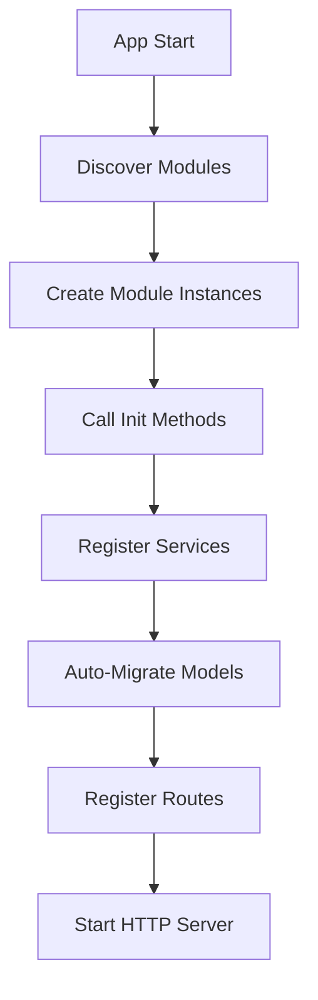

# Module System

Understanding Neonex Core's powerful modular architecture and auto-discovery system.

---

## Overview

Neonex Core uses a **modular monolith** architecture where each feature is encapsulated in an independent, self-contained module. Modules are automatically discovered, registered, and initialized at runtime.

**Key Benefits:**
- 🎯 **Separation of Concerns** - Each module owns its domain
- 🔌 **Plug-and-Play** - Add/remove modules without core changes
- 🔄 **Hot Swap** - Enable/disable features dynamically
- 📦 **Reusability** - Share modules across projects
- 🧪 **Testability** - Test modules in isolation

---

## Module Structure

### Standard Module Layout

```
modules/user/
├── model.go          # GORM models
├── repository.go     # Data access layer
├── service.go        # Business logic
├── controller.go     # HTTP handlers
├── routes.go         # Route definitions
├── di.go            # Dependency injection
├── seeder.go        # Database seeding
├── user.go          # Module entry point
└── module.json      # Module metadata
```

### File Responsibilities

| File | Purpose | Layer |
|------|---------|-------|
| `model.go` | Database entities | Data |
| `repository.go` | CRUD operations | Data Access |
| `service.go` | Business rules | Business Logic |
| `controller.go` | HTTP request handling | Presentation |
| `routes.go` | API endpoint mapping | Routing |
| `di.go` | Service registration | Infrastructure |
| `seeder.go` | Test data | Database |
| `{module}.go` | Module interface implementation | Core |
| `module.json` | Metadata (name, version, deps) | Configuration |

---

## Module Interface

### Interface Definition

```go
// internal/core/module.go
type Module interface {
    Name() string                              // Module identifier
    Init()                                     // Initialize module
    Routes(*fiber.App, *Container)            // Register routes
    RegisterServices(*Container)              // Register dependencies
}
```

### Implementation Example

```go
// modules/user/user.go
package user

import (
    "fmt"
    "github.com/gofiber/fiber/v2"
    "neonexcore/internal/core"
)

type UserModule struct{}

func New() *UserModule {
    return &UserModule{}
}

func (m *UserModule) Name() string {
    return "user"
}

func (m *UserModule) Init() {
    fmt.Println("User module initialized")
}

func (m *UserModule) Routes(app *fiber.App, c *core.Container) {
    controller := core.Resolve[*Controller](c)
    RegisterRoutes(app, controller)
}

func (m *UserModule) RegisterServices(c *core.Container) {
    RegisterDependencies(c)
}
```

**Methods Explained:**

1. **`Name()`** - Returns unique module identifier
2. **`Init()`** - Called once during module initialization
3. **`Routes()`** - Registers HTTP endpoints
4. **`RegisterServices()`** - Registers services in DI container

---

## Module Discovery

### Automatic Discovery

Neonex automatically scans the `modules/` directory and loads all modules:

```go
// internal/core/registry.go
func (r *ModuleRegistry) DiscoverModules() {
    entries, _ := os.ReadDir("./modules")
    
    for _, entry := range entries {
        if entry.IsDir() {
            moduleName := entry.Name()
            // Load module by convention
            // modules/{name}/{name}.go -> New() function
        }
    }
}
```

**Discovery Process:**

1. **Scan** - Read `modules/` directory
2. **Detect** - Find packages with `New()` function
3. **Instantiate** - Call `New()` to create module
4. **Register** - Add to module registry
5. **Initialize** - Call `Init()` method

### Manual Registration

You can also register modules manually:

```go
// main.go
package main

import (
    "neonexcore/internal/core"
    "neonexcore/modules/user"
    "neonexcore/modules/product"
)

func main() {
    app := core.NewApp()
    
    // Manual module registration
    app.Registry.Register(user.New())
    app.Registry.Register(product.New())
    
    app.Boot()
    app.StartHTTP()
}
```

**Use Cases:**
- ✅ Conditional module loading
- ✅ Module priority control
- ✅ Feature flags
- ✅ A/B testing

---

## Module Lifecycle

### Initialization Flow



### Detailed Steps

**1. Discovery Phase**
```go
registry := core.NewModuleRegistry()
registry.DiscoverModules()  // Scan modules/ directory
```

**2. Instantiation Phase**
```go
userModule := user.New()    // Create instance
registry.Register(userModule)
```

**3. Initialization Phase**
```go
for _, module := range registry.modules {
    module.Init()  // Initialize each module
}
```

**4. Service Registration Phase**
```go
for _, module := range registry.modules {
    module.RegisterServices(container)
}
```

**5. Routing Phase**
```go
for _, module := range registry.modules {
    module.Routes(fiberApp, container)
}
```

**6. Runtime Phase**
```
Server ready → Handle requests → Process through modules
```

---

## Module Communication

### ❌ Direct Module-to-Module (Bad)

```go
// modules/order/service.go
import "neonexcore/modules/user"  // ❌ Tight coupling

func (s *OrderService) CreateOrder(userID uint) error {
    user := user.GetUserByID(userID)  // ❌ Direct dependency
    // ...
}
```

**Problems:**
- Tight coupling
- Hard to test
- Circular dependencies
- Breaks module isolation

### ✅ Through Shared Interfaces (Good)

```go
// pkg/interfaces/user.go
package interfaces

type UserProvider interface {
    GetUser(id uint) (*User, error)
    ValidateUser(id uint) bool
}
```

```go
// modules/order/service.go
import "neonexcore/pkg/interfaces"

type OrderService struct {
    userProvider interfaces.UserProvider
}

func (s *OrderService) CreateOrder(userID uint) error {
    if !s.userProvider.ValidateUser(userID) {
        return errors.New("invalid user")
    }
    // ...
}
```

**Benefits:**
- ✅ Loose coupling
- ✅ Easy to mock
- ✅ Testable
- ✅ Swappable implementations

### ✅ Through Events (Better)

```go
// pkg/events/events.go
type OrderCreatedEvent struct {
    OrderID uint
    UserID  uint
    Total   float64
}

type EventBus interface {
    Publish(event interface{})
    Subscribe(eventType string, handler func(interface{}))
}
```

```go
// modules/order/service.go
func (s *OrderService) CreateOrder(order *Order) error {
    // Create order
    s.repo.Create(order)
    
    // Publish event
    s.eventBus.Publish(&events.OrderCreatedEvent{
        OrderID: order.ID,
        UserID:  order.UserID,
        Total:   order.Total,
    })
    
    return nil
}
```

```go
// modules/notification/service.go
func (s *NotificationService) Init() {
    s.eventBus.Subscribe("OrderCreated", s.handleOrderCreated)
}

func (s *NotificationService) handleOrderCreated(event interface{}) {
    orderEvent := event.(*events.OrderCreatedEvent)
    // Send notification
}
```

**Benefits:**
- ✅ Complete decoupling
- ✅ Async processing
- ✅ Multiple listeners
- ✅ Event sourcing ready

---

## Module Configuration

### module.json

```json
{
  "name": "user",
  "version": "1.0.0",
  "description": "User management module",
  "author": "Your Name",
  "dependencies": [],
  "enabled": true,
  "priority": 10
}
```

**Fields:**
- `name` - Unique module identifier
- `version` - Semantic version (semver)
- `description` - Module purpose
- `author` - Creator information
- `dependencies` - Required modules
- `enabled` - Enable/disable flag
- `priority` - Load order (higher = earlier)

### Loading Configuration

```go
// modules/user/user.go
import "encoding/json"

type ModuleConfig struct {
    Name         string   `json:"name"`
    Version      string   `json:"version"`
    Description  string   `json:"description"`
    Dependencies []string `json:"dependencies"`
    Enabled      bool     `json:"enabled"`
}

func LoadConfig() (*ModuleConfig, error) {
    data, err := os.ReadFile("modules/user/module.json")
    if err != nil {
        return nil, err
    }
    
    var config ModuleConfig
    if err := json.Unmarshal(data, &config); err != nil {
        return nil, err
    }
    
    return &config, nil
}
```

---

## Advanced Module Patterns

### 1. Module Dependencies

```json
// modules/order/module.json
{
  "name": "order",
  "dependencies": ["user", "product", "payment"]
}
```

```go
// internal/core/registry.go
func (r *ModuleRegistry) LoadWithDependencies() error {
    // Topological sort based on dependencies
    sorted := r.resolveDependencies()
    
    for _, moduleName := range sorted {
        module := r.modules[moduleName]
        module.Init()
    }
}
```

### 2. Conditional Loading

```go
// main.go
func main() {
    app := core.NewApp()
    
    // Load based on environment
    if os.Getenv("ENABLE_PAYMENTS") == "true" {
        app.Registry.Register(payment.New())
    }
    
    // Load based on feature flag
    if featureflags.IsEnabled("analytics") {
        app.Registry.Register(analytics.New())
    }
    
    app.Boot()
    app.StartHTTP()
}
```

### 3. Module Versioning

```go
type Module interface {
    Name() string
    Version() string  // Added version method
    Init()
    // ...
}

// Check version compatibility
func (r *ModuleRegistry) checkCompatibility() error {
    for _, module := range r.modules {
        version := module.Version()
        if !isCompatible(version, "1.x") {
            return fmt.Errorf("module %s version %s not compatible", 
                module.Name(), version)
        }
    }
    return nil
}
```

### 4. Module Hooks

```go
type Module interface {
    Name() string
    Init()
    BeforeStart()  // Called before server starts
    AfterStart()   // Called after server starts
    OnShutdown()   // Called on graceful shutdown
    // ...
}
```

---

## Best Practices

### ✅ DO:

**1. Keep Modules Independent**
```go
// Good: Module doesn't depend on other modules
package user

import "neonexcore/pkg/database"

type Service struct {
    repo Repository
}
```

**2. Use Clear Naming**
```
modules/
├── user/          # ✅ Clear
├── product/       # ✅ Clear
└── order/         # ✅ Clear
```

**3. Follow Single Responsibility**
```go
// User module handles ONLY user-related operations
// - Authentication → separate auth module
// - Notifications → separate notification module
```

**4. Document Module Purpose**
```go
// Package user provides user management functionality.
//
// This module handles:
// - User CRUD operations
// - User profile management
// - User search and filtering
//
// It does NOT handle:
// - Authentication (see auth module)
// - Authorization (see rbac module)
package user
```

### ❌ DON'T:

**1. Import Other Modules**
```go
// Bad: Direct module import
import "neonexcore/modules/user"
```

**2. Use Global State**
```go
// Bad: Global variables
var currentUser *User
```

**3. Mix Responsibilities**
```go
// Bad: User module handling orders
func (u *UserService) CreateOrder() error {
    // This belongs in order module!
}
```

**4. Tight Coupling**
```go
// Bad: Hardcoded dependencies
type Service struct {
    userRepo user.Repository  // ❌ Direct dependency
}
```

---

## Examples

### Example 1: Simple Module

```go
// modules/health/health.go
package health

import (
    "github.com/gofiber/fiber/v2"
    "neonexcore/internal/core"
)

type HealthModule struct{}

func New() *HealthModule {
    return &HealthModule{}
}

func (m *HealthModule) Name() string {
    return "health"
}

func (m *HealthModule) Init() {
    // No initialization needed
}

func (m *HealthModule) Routes(app *fiber.App, c *core.Container) {
    app.Get("/health", func(ctx *fiber.Ctx) error {
        return ctx.JSON(fiber.Map{
            "status": "healthy",
            "module": "health",
        })
    })
}

func (m *HealthModule) RegisterServices(c *core.Container) {
    // No services to register
}
```

### Example 2: Module with Dependencies

```go
// modules/analytics/analytics.go
package analytics

type AnalyticsModule struct {
    config *Config
}

func New() *AnalyticsModule {
    config, _ := LoadConfig()
    return &AnalyticsModule{config: config}
}

func (m *AnalyticsModule) Init() {
    if !m.config.Enabled {
        return
    }
    // Initialize analytics service
}

func (m *AnalyticsModule) RegisterServices(c *core.Container) {
    c.Provide(func() Service {
        return NewService(m.config)
    }, core.Singleton)
}
```

### Example 3: Module with Events

```go
// modules/audit/audit.go
package audit

type AuditModule struct {
    eventBus EventBus
}

func (m *AuditModule) Init() {
    // Subscribe to events
    m.eventBus.Subscribe("UserCreated", m.logUserCreated)
    m.eventBus.Subscribe("OrderPlaced", m.logOrderPlaced)
}

func (m *AuditModule) logUserCreated(event interface{}) {
    // Log to audit trail
}
```

---

## Troubleshooting

### Module Not Discovered

**Problem:** Module exists but not loaded.

**Solution:**
1. Check module structure:
   ```bash
   ls modules/mymodule/
   # Should contain mymodule.go with New() function
   ```

2. Verify `New()` function:
   ```go
   func New() *MyModule {
       return &MyModule{}
   }
   ```

3. Check module.json exists and valid

### Circular Dependencies

**Problem:** Module A depends on B, B depends on A.

**Solution:**
1. Extract shared logic to `pkg/`
2. Use interfaces instead of concrete types
3. Use event-driven communication

### Module Load Order

**Problem:** Module B needs module A but A loads after B.

**Solution:**
```json
// modules/b/module.json
{
  "name": "b",
  "dependencies": ["a"],
  "priority": 5
}
```

---

## Next Steps

- [**Dependency Injection**](dependency-injection.md) - Master the DI container
- [**Repository Pattern**](repository-pattern.md) - Data access layer
- [**Service Layer**](service-layer.md) - Business logic organization
- [**Module Lifecycle**](lifecycle.md) - Deep dive into initialization

---

**Need help?** Check [FAQ](../resources/faq.md) or [get support](../resources/support.md).
